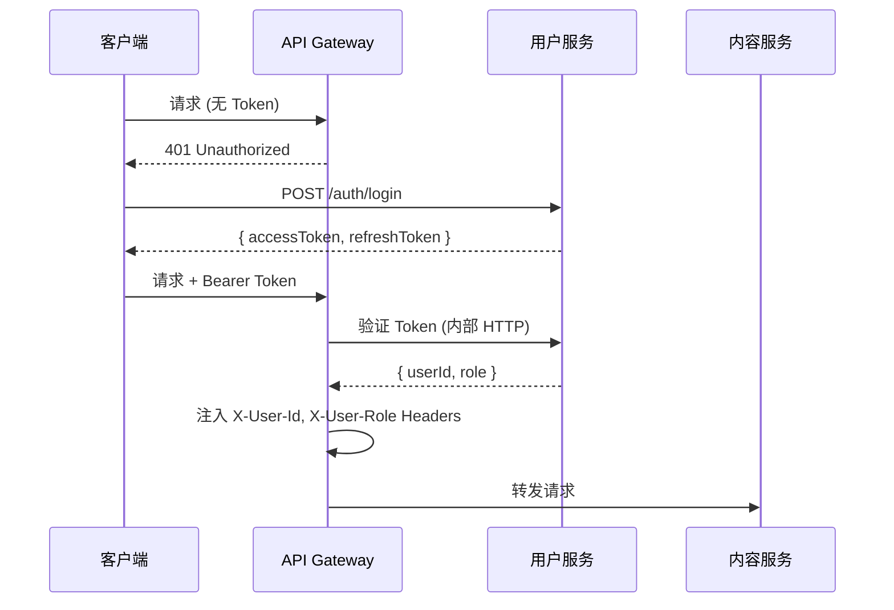

# API 文档 — Pro-OW

> 版本: v1.0 | 日期: 2026-05-29 | 规范: OpenAPI 3.0 (Swagger)

---

## 一、通用规范

### 1.1 基础 URL

```
开发环境: http://localhost:8080/api/v1
生产环境: https://api.pro-ow.com/v1
```

### 1.2 鉴权方式

| 方式 | 说明 |
|---|---|
| Bearer Token | JWT AccessToken，Header: `Authorization: Bearer <token>` |
| 有效期 | AccessToken 15 分钟，RefreshToken 7 天 |
| 刷新 | POST `/auth/refresh`，返回新的 AccessToken |

**鉴权流程：**



### 1.3 通用响应格式

```json
// 成功
{
  "code": 0,
  "message": "ok",
  "data": { ... }
}

// 分页
{
  "code": 0,
  "message": "ok",
  "data": {
    "items": [ ... ],
    "total": 100,
    "page": 1,
    "pageSize": 20,
    "totalPages": 5
  }
}

// 错误
{
  "code": 40100,
  "message": "未登录或 Token 已过期",
  "data": null
}
```

### 1.4 错误码规范

| 范围 | 说明 |
|---|---|
| 0 | 成功 |
| 40000-40099 | 参数校验错误 |
| 40100-40199 | 认证/鉴权错误 |
| 40300-40399 | 权限不足 |
| 40400-40499 | 资源不存在 |
| 40900-40999 | 业务冲突（重复操作等） |
| 42900-42999 | 限流 |
| 50000-50099 | 服务器内部错误 |

### 1.5 通用请求头

| Header | 必填 | 说明 |
|---|---|---|
| Authorization | 条件 | Bearer Token |
| Content-Type | 是 | application/json |
| X-Request-Id | 推荐 | 请求追踪 ID (UUID) |

---

## 二、用户服务 API (user-service)

### 2.1 认证

#### POST /auth/register — 注册

```
Request:
{
  "username": "genji_main_99",
  "email": "genji@example.com",
  "password": "SecurePass123!"
}

Response 201:
{
  "code": 0,
  "message": "注册成功",
  "data": {
    "userId": "uuid",
    "username": "genji_main_99"
  }
}
```

#### POST /auth/login — 登录

```
Request:
{
  "email": "genji@example.com",
  "password": "SecurePass123!"
}

Response 200:
{
  "code": 0,
  "data": {
    "accessToken": "eyJhbG...",
    "refreshToken": "d8f7a2...",
    "expiresIn": 900
  }
}
```

#### POST /auth/refresh — 刷新 Token

```
Headers: Authorization: Bearer <refreshToken>

Response 200:
{
  "code": 0,
  "data": {
    "accessToken": "eyJhbG...new",
    "expiresIn": 900
  }
}
```

#### POST /auth/logout — 登出

```
Headers: Authorization: Bearer <accessToken>

Response 200:
{
  "code": 0,
  "message": "已登出"
}
```

---

### 2.2 用户信息

#### GET /users/me — 获取当前用户信息

```
Headers: Authorization: Bearer <token>

Response 200:
{
  "code": 0,
  "data": {
    "id": "uuid",
    "username": "genji_main_99",
    "email": "genji@example.com",
    "avatarUrl": "https://cdn.pro-ow.com/avatars/xxx.jpg",
    "role": "user",
    "profile": {
      "nickname": "源氏之神",
      "bio": "500小时源氏专精",
      "battlenetLinked": true,
      "battlenetData": {
        "tankSr": 3200,
        "dpsSr": 2800,
        "supportSr": 3500,
        "mostPlayedHeroes": ["genji", "hanzo", "kiriko"]
      }
    },
    "stats": {
      "exp": 2500,
      "level": 12,
      "points": 800,
      "postCount": 45,
      "commentCount": 230,
      "likeReceived": 1200
    },
    "badges": [
      { "id": "uuid", "name": "源氏大师", "rarity": "epic", "iconUrl": "..." }
    ]
  }
}
```

#### GET /users/:id — 获取用户公开信息

无需登录，返回公开资料 + 统计数据

#### PATCH /users/me/profile — 更新个人资料

```
Request:
{
  "nickname": "源氏之主",
  "bio": "新赛季冲宗师！",
  "signature": "竜神の剣を喰らえ"
}
```

#### PATCH /users/me/avatar — 上传头像

```
Content-Type: multipart/form-data
Body: file=<image>
```

---

## 三、内容服务 API (content-service)

### 3.1 板块

#### GET /boards — 获取板块列表

```
Query:
  parentId?: string     # 获取子板块(可选)

Response 200:
{
  "code": 0,
  "data": [
    {
      "id": "uuid",
      "name": "英雄攻略",
      "slug": "hero-guides",
      "description": "各英雄玩法、连招、阵容搭配攻略",
      "icon": "sword",
      "postCount": 1234,
      "children": [
        { "id": "uuid", "name": "源氏", "slug": "genji", "heroTag": "genji" }
      ]
    }
  ]
}
```

### 3.2 帖子

#### GET /posts — 获取帖子列表

```
Query:
  boardId?: string      # 板块筛选
  tag?: string          # 标签筛选
  sort?: string         # latest(默认) / hot / featured
  page?: number         # 默认 1
  pageSize?: number     # 默认 20, 最大 50

Response 200:
{
  "code": 0,
  "data": {
    "items": [
      {
        "id": "uuid",
        "title": "源氏超级跳的三种进阶用法",
        "summary": "今天给大家分享源氏超级跳的三种...",
        "author": {
          "id": "uuid",
          "username": "genji_main_99",
          "avatarUrl": "..."
        },
        "board": { "id": "uuid", "name": "源氏", "slug": "genji" },
        "tags": [{ "id": "uuid", "name": "技巧", "color": "#FF5733" }],
        "likeCount": 42,
        "commentCount": 18,
        "viewCount": 1200,
        "isFeatured": true,
        "isPinned": false,
        "createdAt": "2026-05-29T10:30:00Z"
      }
    ],
    "total": 256,
    "page": 1,
    "pageSize": 20,
    "totalPages": 13
  }
}
```

#### GET /posts/:id — 获取帖子详情

```
Response 200:
{
  "code": 0,
  "data": {
    "id": "uuid",
    "title": "源氏超级跳的三种进阶用法",
    "content": "# Markdown 正文...",
    "contentHtml": "<h1>渲染后...</h1>",
    "author": { ... },
    "board": { ... },
    "tags": [ ... ],
    "likeCount": 42,
    "commentCount": 18,
    "viewCount": 1200,
    "isLiked": true,
    "isFavorited": false,
    "createdAt": "2026-05-29T10:30:00Z",
    "updatedAt": "2026-05-29T11:00:00Z"
  }
}
```

#### POST /posts — 创建帖子

```
Headers: Authorization: Bearer <token>

Request:
{
  "boardId": "uuid",
  "title": "源氏超级跳的三种进阶用法",
  "content": "# Markdown 正文...",
  "tagIds": ["uuid1", "uuid2"],
  "postType": "normal"
}

Response 201:
{
  "code": 0,
  "message": "发布成功",
  "data": { "id": "uuid" }
}
```

#### PATCH /posts/:id — 编辑帖子

权限：仅作者本人

#### DELETE /posts/:id — 删除帖子（软删除）

权限：作者本人 / 版主 / 管理员

### 3.3 评论

#### GET /posts/:id/comments — 获取帖子评论

```
Query:
  sort?: string    # latest(默认) / hot
  page?: number
  pageSize?: number

Response 200:
{
  "code": 0,
  "data": {
    "items": [
      {
        "id": "uuid",
        "content": "感谢分享，学到了！",
        "author": { "id": "uuid", "username": "player_one", "avatarUrl": "..." },
        "likeCount": 5,
        "replyCount": 2,
        "isLiked": false,
        "createdAt": "2026-05-29T12:00:00Z"
      }
    ],
    "total": 18,
    ...
  }
}
```

#### POST /posts/:id/comments — 发表评论

```
Request:
{
  "content": "感谢分享！",
  "parentId": "uuid",     # 回复某条评论(楼中楼)
  "replyToId": "uuid"     # 回复对象用户 ID
}
```

### 3.4 搜索

#### GET /search — 全文搜索

```
Query:
  q: string            # 搜索关键词(必填)
  boardId?: string     # 板块筛选
  tag?: string         # 标签筛选
  sort?: string        # relevance(默认) / latest
  page?: number

Response 200:
{
  "code": 0,
  "data": {
    "items": [
      {
        "id": "uuid",
        "title": "...",
        "summary": "...高亮片段...",
        "author": { ... },
        "board": { ... },
        "createdAt": "..."
      }
    ],
    "total": 89,
    "took": 45          # 搜索耗时(ms)
  }
}
```

#### GET /search/suggest — 搜索建议(自动补全)

```
Query:
  q: string

Response 200:
{
  "code": 0,
  "data": ["源氏连招", "源氏皮肤", "源氏超级跳"]
}
```

---

## 四、社交服务 API (social-service)

### 4.1 点赞

#### POST /posts/:id/like — 点赞帖子
#### DELETE /posts/:id/like — 取消点赞

#### POST /comments/:id/like — 点赞评论
#### DELETE /comments/:id/like — 取消点赞

### 4.2 收藏

#### POST /posts/:id/favorite — 收藏帖子
#### DELETE /posts/:id/favorite — 取消收藏

#### GET /users/me/favorites — 我的收藏列表

### 4.3 关注

#### POST /users/:id/follow — 关注用户
#### DELETE /users/:id/follow — 取消关注

#### GET /users/:id/followers — 粉丝列表
#### GET /users/:id/following — 关注列表

### 4.4 通知

#### GET /notifications — 获取通知列表

```
Query:
  type?: string         # 通知类型筛选
  isRead?: boolean      # 已读/未读
  page?: number

Response 200:
{
  "code": 0,
  "data": {
    "items": [
      {
        "id": "uuid",
        "type": "reply",
        "title": "新回复",
        "content": "player_one 回复了你的帖子",
        "sourceType": "comment",
        "sourceId": "uuid",
        "isRead": false,
        "createdAt": "..."
      }
    ],
    "unreadCount": 5,
    ...
  }
}
```

#### PATCH /notifications/read-all — 全部标为已读
#### PATCH /notifications/:id/read — 标记单条已读

#### GET /notifications/unread-count — 获取未读数量

---

## 五、实时服务 WebSocket (realtime-service)

### 5.1 连接

```
ws://localhost:8081/ws?token=<accessToken>
```

### 5.2 消息格式

```json
// 服务端 → 客户端
{
  "type": "notification",
  "payload": {
    "id": "uuid",
    "title": "新回复",
    "content": "..."
  }
}

// 客户端 → 服务端 (心跳)
{
  "type": "ping"
}

// 服务端 → 客户端
{
  "type": "pong"
}
```

### 5.3 频道

| 频道 | 说明 |
|---|---|
| user:{userId} | 用户个人频道（通知、消息） |
| post:{postId} | 帖子实时更新（新评论提醒） |
| team:{teamId} | 队伍频道（组队聊天） |

---

## 六、后续服务 API (规划中)

> 以下接口为 v0.2+ 版本规划，此处仅列大纲。

### 数据服务
- `GET /leaderboard?type=exp|posts|likes&period=season|all` — 排行榜
- `GET /users/:id/stats` — 用户数据统计详情

### 组队服务
- `POST /teams` — 创建队伍
- `GET /teams?srMin=&srMax=&position=` — 搜索队伍
- `POST /teams/:id/join` — 加入队伍

### 竞猜服务
- `GET /matches` — 比赛列表
- `POST /matches/:id/bet` — 下注
- `GET /bets/my` — 我的竞猜

### AI 服务
- `POST /ai/replay-analysis` — 上传录像代码，触发 AI 复盘
- `GET /ai/replay-analysis/:id` — 获取复盘结果

---

## 七、接口开发优先级

| 优先级 | 服务 | 接口 |
|---|---|---|
| P0 | user | register, login, refresh, me, profile |
| P0 | content | boards, posts CRUD, comments |
| P0 | search | search, suggest |
| P0 | social | like, favorite, follow, notification |
| P1 | realtime | WebSocket 通知推送 |
| P1 | social | 通知设置 |
| P1 | content | 精华/置顶管理 |
| P2 | data | 排行榜, 赛季 |
| P2 | team | 组队相关 |
| P2 | bet | 竞猜相关 |
| P2 | ai | 复盘分析 |