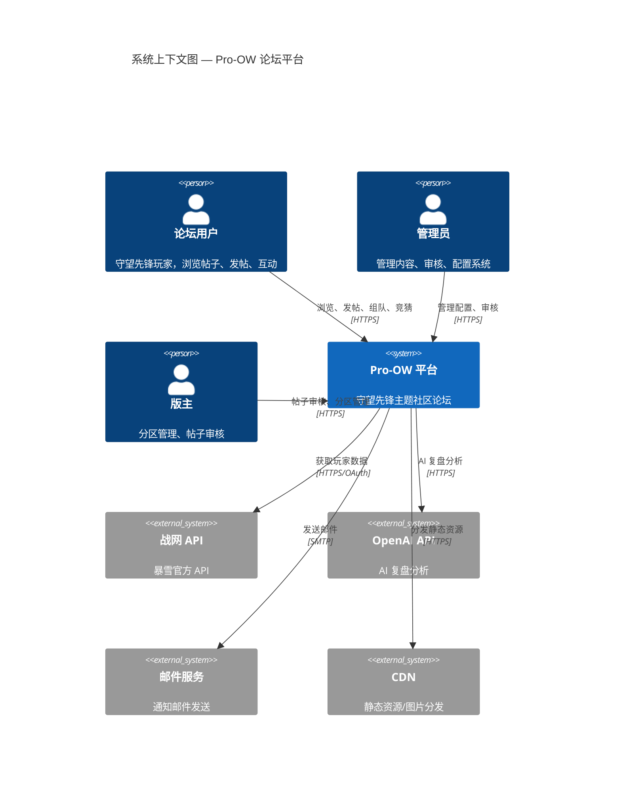
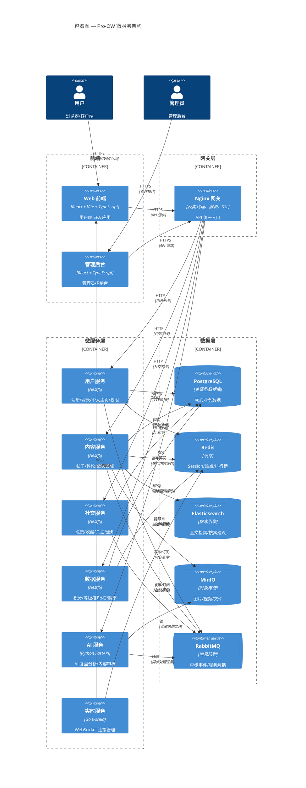
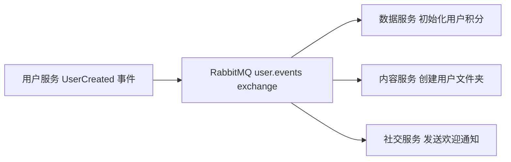
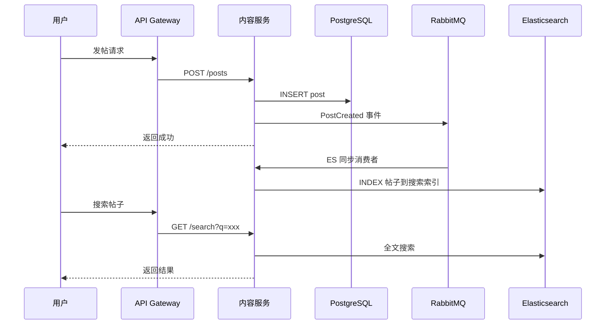
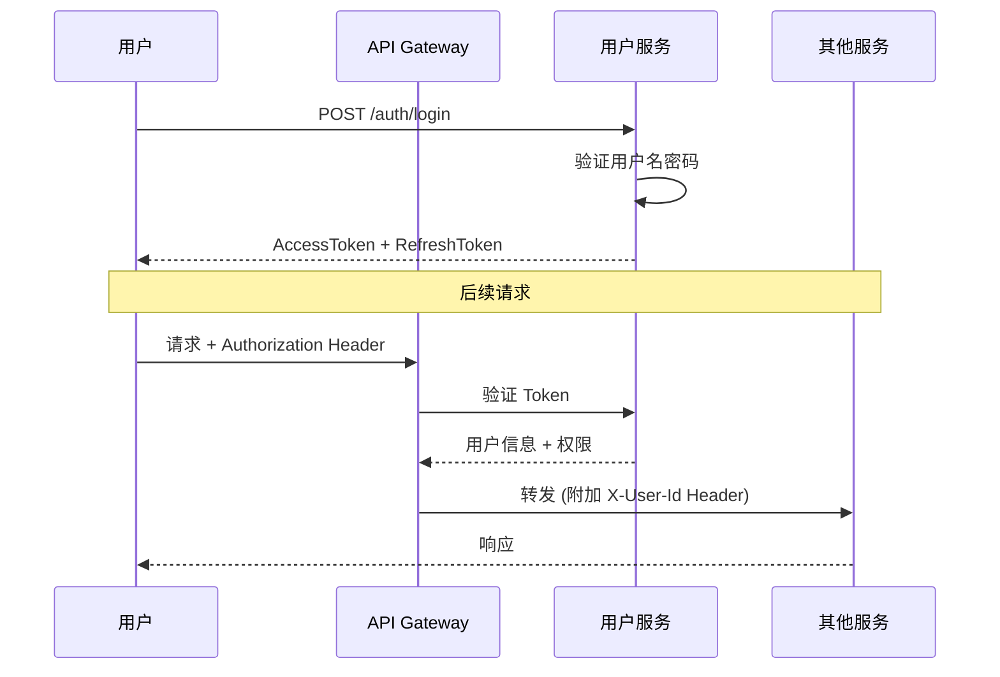
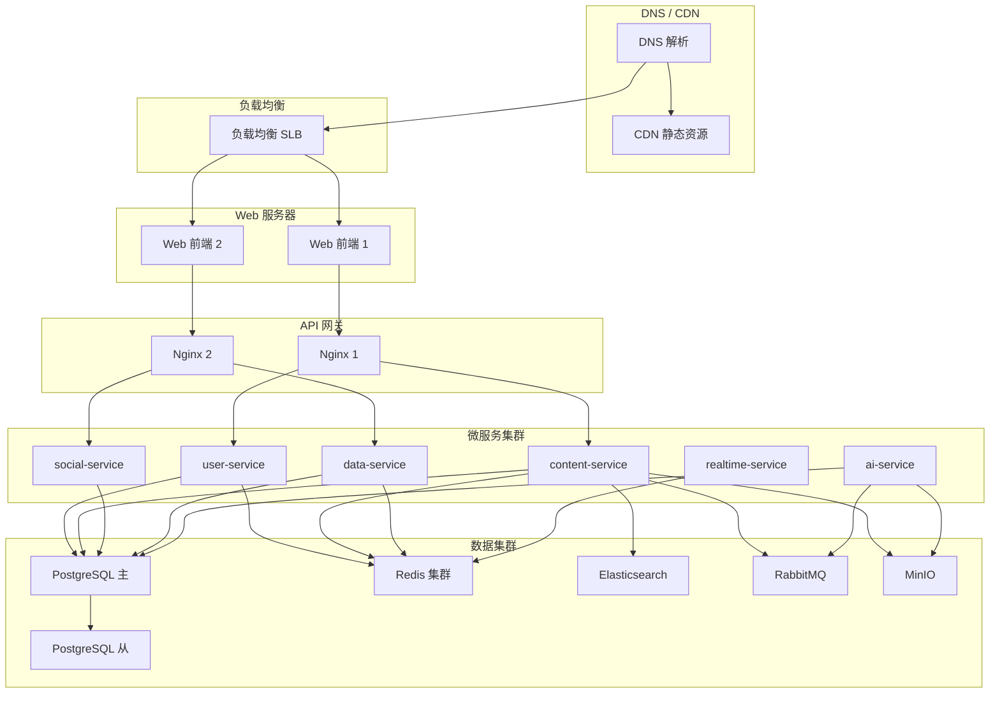

# 系统架构设计文档 — Pro-OW

> 版本: v1.0 | 日期: 2026-05-29 | 框架: C4 模型

---

## 一、C4 Level 1 — 系统上下文图 (System Context)

---

## 二、C4 Level 2 — 容器图 (Container Diagram)

---

## 三、模块职责划分

| 服务 | 核心职责 | 依赖 |
|---|---|---|
| user-service | 注册/登录/鉴权、个人主页、用户信息管理、权限管理 | PostgreSQL, Redis, RabbitMQ |
| content-service | 帖子 CRUD、评论 CRUD、板块管理、搜索、审核 | PostgreSQL, Elasticsearch, MinIO, RabbitMQ |
| social-service | 点赞/取消赞、收藏/取消收藏、关注/取消关注、通知 | PostgreSQL, Redis, RabbitMQ |
| data-service | 积分计算、等级管理、排行榜、赛季管理、数据统计 | PostgreSQL, Redis, RabbitMQ |
| ai-service | AI 复盘分析、内容审核辅助、智能推荐 | OpenAI API, MinIO, RabbitMQ |
| realtime-service | WebSocket 连接管理、实时消息推送、在线状态 | Redis |

---

## 四、关键技术决策

### 4.1 事件驱动通信

服务间通过 RabbitMQ 异步通信，采用**发布/订阅**模式：

**事件类型定义：**

| Exchange | 事件 | 发布者 | 订阅者 |
|---|---|---|---|
| user.events | UserCreated | user-service | data-service, social-service |
| user.events | UserBanned | user-service | content-service |
| content.events | PostCreated | content-service | data-service, es-sync |
| content.events | PostDeleted | content-service | data-service, es-sync |
| content.events | CommentCreated | content-service | social-service, data-service |
| social.events | PostLiked | social-service | data-service |
| social.events | UserFollowed | social-service | realtime-service |
| ai.events | ReplayAnalysisCompleted | ai-service | content-service, social-service |

### 4.2 读写分离 (CQRS Lite)

- **写操作**：服务 → PostgreSQL
- **读操作**：Web → API Gateway → 查询 Elasticsearch 或 Redis 缓存
- **同步**：RabbitMQ 事件驱动，PostgreSQL 写入后异步同步到 ES

### 4.3 缓存策略

| 数据类型 | 缓存策略 | 过期时间 |
|---|---|---|
| 帖子详情 | Cache-Aside (先查缓存，未命中查 DB) | 10 分钟 |
| 热门帖子列表 | Write-Through (写 DB 同时更新缓存) | 5 分钟 |
| 用户 Session | Redis 存储 | 7 天 |
| 排行榜 (Sorted Set) | 定时任务更新 | 实时 |
| 限流计数器 | Redis INCR + TTL | 按窗口 |

### 4.4 鉴权方案

- **AccessToken**：JWT，15 分钟过期
- **RefreshToken**：随机字符串，7 天过期，存储在 Redis
- **网关鉴权**：Nginx 层不做鉴权，转发到 user-service 统一鉴权

---

## 五、部署架构

