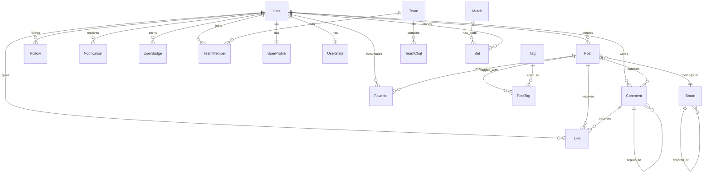

# 数据库设计文档 — Pro-OW

> 版本: v1.0 | 日期: 2026-05-29 | 数据库: PostgreSQL 16

---

## 一、ER 总览图



---

## 二、用户域 (User Domain)

### 2.1 users — 用户主表

| 字段 | 类型 | 约束 | 说明 |
|---|---|---|---|
| id | UUID | PK, DEFAULT gen_random_uuid() | 用户唯一标识 |
| username | VARCHAR(30) | UNIQUE, NOT NULL | 用户名 |
| email | VARCHAR(255) | UNIQUE, NOT NULL | 邮箱 |
| password_hash | VARCHAR(255) | NOT NULL | bcrypt 加密密码 |
| avatar_url | VARCHAR(500) | NULL | 头像 URL |
| role | user_role ENUM | NOT NULL, DEFAULT 'user' | 角色: user/moderator/admin |
| status | user_status ENUM | NOT NULL, DEFAULT 'active' | 状态: active/banned/deleted |
| created_at | TIMESTAMPTZ | NOT NULL, DEFAULT NOW() | 注册时间 |
| updated_at | TIMESTAMPTZ | NOT NULL, DEFAULT NOW() | 更新时间 |
| last_login_at | TIMESTAMPTZ | NULL | 最后登录时间 |

**索引：**
- `idx_users_email` ON (email)
- `idx_users_username` ON (username)
- `idx_users_status` ON (status)

```sql
CREATE TYPE user_role AS ENUM ('user', 'moderator', 'admin');
CREATE TYPE user_status AS ENUM ('active', 'banned', 'deleted');
```

### 2.2 user_profiles — 用户资料

| 字段 | 类型 | 约束 | 说明 |
|---|---|---|---|
| id | UUID | PK | 资料 ID |
| user_id | UUID | FK → users, UNIQUE | 关联用户 |
| nickname | VARCHAR(50) | NULL | 昵称 |
| bio | TEXT | NULL | 个人简介(最大 500 字) |
| signature | VARCHAR(200) | NULL | 签名 |
| battletag | VARCHAR(50) | NULL | 战网 Battletag |
| battlenet_linked | BOOLEAN | DEFAULT false | 是否已绑定战网 |
| battlenet_data | JSONB | NULL | 战网 API 数据快照 |
| location | VARCHAR(100) | NULL | 所在地 |
| website | VARCHAR(255) | NULL | 个人网站 |

**battlenet_data JSONB 结构：**
```json
{
  "tank_sr": 3200,
  "dps_sr": 2800,
  "support_sr": 3500,
  "most_played_heroes": ["ana", "zenyatta", "kiriko"],
  "total_hours": 1500,
  "last_updated": "2026-05-29T00:00:00Z"
}
```

### 2.3 user_stats — 用户统计

| 字段 | 类型 | 约束 | 说明 |
|---|---|---|---|
| id | UUID | PK | 统计 ID |
| user_id | UUID | FK → users, UNIQUE | 关联用户 |
| exp | INTEGER | DEFAULT 0 | 经验值 |
| level | INTEGER | DEFAULT 1 | 等级 |
| points | INTEGER | DEFAULT 0 | 竞猜积分 |
| post_count | INTEGER | DEFAULT 0 | 发帖数 |
| comment_count | INTEGER | DEFAULT 0 | 评论数 |
| like_received | INTEGER | DEFAULT 0 | 被赞数 |
| season_exp | INTEGER | DEFAULT 0 | 本赛季经验 |
| season_rank | INTEGER | NULL | 本赛季排名 |

### 2.4 refresh_tokens

| 字段 | 类型 | 约束 | 说明 |
|---|---|---|---|
| id | UUID | PK | Token ID |
| user_id | UUID | FK → users | 关联用户 |
| token | VARCHAR(255) | UNIQUE, NOT NULL | RefreshToken 值 |
| expires_at | TIMESTAMPTZ | NOT NULL | 过期时间 |
| revoked | BOOLEAN | DEFAULT false | 是否已吊销 |
| created_at | TIMESTAMPTZ | DEFAULT NOW() | 创建时间 |

---

## 三、内容域 (Content Domain)

### 3.1 boards — 板块

| 字段 | 类型 | 约束 | 说明 |
|---|---|---|---|
| id | UUID | PK | 板块 ID |
| name | VARCHAR(50) | NOT NULL | 板块名 |
| slug | VARCHAR(50) | UNIQUE, NOT NULL | URL 友好标识 |
| description | TEXT | NULL | 板块描述 |
| icon | VARCHAR(50) | NULL | 图标 |
| parent_id | UUID | FK → boards, NULL | 父板块 (子板块) |
| sort_order | INTEGER | DEFAULT 0 | 排序 |
| is_visible | BOOLEAN | DEFAULT true | 是否可见 |
| hero_tag | VARCHAR(20) | NULL | 关联英雄(英雄攻略板块专用) |

### 3.2 posts — 帖子

| 字段 | 类型 | 约束 | 说明 |
|---|---|---|---|
| id | UUID | PK | 帖子 ID |
| board_id | UUID | FK → boards, NOT NULL | 所属板块 |
| author_id | UUID | FK → users, NOT NULL | 作者 |
| title | VARCHAR(200) | NOT NULL | 标题 |
| content | TEXT | NOT NULL | Markdown 正文 |
| content_html | TEXT | NOT NULL | 渲染后 HTML |
| summary | VARCHAR(500) | NULL | 摘要(列表展示用) |
| post_type | post_type ENUM | DEFAULT 'normal' | normal/poll/gallery |
| status | post_status ENUM | DEFAULT 'published' | published/draft/hidden/deleted |
| is_pinned | BOOLEAN | DEFAULT false | 是否置顶 |
| is_featured | BOOLEAN | DEFAULT false | 是否精华 |
| view_count | INTEGER | DEFAULT 0 | 浏览数 |
| like_count | INTEGER | DEFAULT 0 | 点赞数(冗余) |
| comment_count | INTEGER | DEFAULT 0 | 评论数(冗余) |
| created_at | TIMESTAMPTZ | DEFAULT NOW() | 创建时间 |
| updated_at | TIMESTAMPTZ | DEFAULT NOW() | 更新时间 |
| published_at | TIMESTAMPTZ | NULL | 发布时间 |

**索引：**
- `idx_posts_board_created` ON (board_id, created_at DESC)
- `idx_posts_author_created` ON (author_id, created_at DESC)
- `idx_posts_status` ON (status)
- `idx_posts_featured` ON (is_featured) WHERE is_featured = true
- `idx_posts_fts` GIN (to_tsvector('simple', title || ' ' || content)) — 降级全文检索

### 3.3 tags — 标签

| 字段 | 类型 | 约束 | 说明 |
|---|---|---|---|
| id | UUID | PK | 标签 ID |
| name | VARCHAR(30) | UNIQUE, NOT NULL | 标签名 |
| slug | VARCHAR(30) | UNIQUE, NOT NULL | URL 友好标识 |
| color | VARCHAR(7) | NULL | 标签颜色(Hex) |
| post_count | INTEGER | DEFAULT 0 | 使用次数(冗余) |

### 3.4 post_tags — 帖子-标签关联

| 字段 | 类型 | 约束 | 说明 |
|---|---|---|---|
| post_id | UUID | FK → posts, PK | 帖子 ID |
| tag_id | UUID | FK → tags, PK | 标签 ID |

### 3.5 comments — 评论

| 字段 | 类型 | 约束 | 说明 |
|---|---|---|---|
| id | UUID | PK | 评论 ID |
| post_id | UUID | FK → posts, NOT NULL | 所属帖子 |
| author_id | UUID | FK → users, NOT NULL | 评论作者 |
| parent_id | UUID | FK → comments, NULL | 父评论(楼中楼) |
| reply_to_id | UUID | FK → users, NULL | 回复目标用户 |
| content | TEXT | NOT NULL | 评论内容 |
| status | comment_status ENUM | DEFAULT 'published' | published/hidden/deleted |
| like_count | INTEGER | DEFAULT 0 | 点赞数 |
| reply_count | INTEGER | DEFAULT 0 | 回复数(冗余) |
| created_at | TIMESTAMPTZ | DEFAULT NOW() | 创建时间 |
| updated_at | TIMESTAMPTZ | DEFAULT NOW() | 更新时间 |

**索引：**
- `idx_comments_post_created` ON (post_id, created_at ASC)
- `idx_comments_parent` ON (parent_id)

### 3.6 media — 媒体资源

| 字段 | 类型 | 约束 | 说明 |
|---|---|---|---|
| id | UUID | PK | 资源 ID |
| user_id | UUID | FK → users | 上传者 |
| post_id | UUID | FK → posts, NULL | 关联帖子 |
| file_name | VARCHAR(255) | NOT NULL | 原始文件名 |
| file_path | VARCHAR(500) | NOT NULL | MinIO 存储路径 |
| file_size | INTEGER | NOT NULL | 文件大小(字节) |
| mime_type | VARCHAR(100) | NOT NULL | MIME 类型 |
| width | INTEGER | NULL | 图片宽度 |
| height | INTEGER | NULL | 图片高度 |
| created_at | TIMESTAMPTZ | DEFAULT NOW() | 上传时间 |

---

## 四、社交域 (Social Domain)

### 4.1 likes — 点赞

| 字段 | 类型 | 约束 | 说明 |
|---|---|---|---|
| id | UUID | PK | 点赞 ID |
| user_id | UUID | FK → users | 点赞用户 |
| target_type | like_target ENUM | NOT NULL | post / comment |
| target_id | UUID | NOT NULL | 目标 ID (posts/comments) |
| created_at | TIMESTAMPTZ | DEFAULT NOW() | 点赞时间 |

**唯一约束：** `uk_likes` ON (user_id, target_type, target_id)

### 4.2 favorites — 收藏

| 字段 | 类型 | 约束 | 说明 |
|---|---|---|---|
| id | UUID | PK | 收藏 ID |
| user_id | UUID | FK → users | 收藏用户 |
| post_id | UUID | FK → posts | 收藏帖子 |
| created_at | TIMESTAMPTZ | DEFAULT NOW() | 收藏时间 |

**唯一约束：** `uk_favorites` ON (user_id, post_id)

### 4.3 follows — 关注

| 字段 | 类型 | 约束 | 说明 |
|---|---|---|---|
| id | UUID | PK | 关注 ID |
| follower_id | UUID | FK → users | 关注者 |
| followed_id | UUID | FK → users | 被关注者 |
| created_at | TIMESTAMPTZ | DEFAULT NOW() | 关注时间 |

**唯一约束：** `uk_follows` ON (follower_id, followed_id)

### 4.4 notifications — 通知

| 字段 | 类型 | 约束 | 说明 |
|---|---|---|---|
| id | UUID | PK | 通知 ID |
| user_id | UUID | FK → users | 接收用户 |
| type | notify_type ENUM | NOT NULL | 通知类型 |
| title | VARCHAR(200) | NOT NULL | 通知标题 |
| content | TEXT | NOT NULL | 通知内容 |
| source_type | VARCHAR(30) | NULL | 来源类型(post/comment/user) |
| source_id | UUID | NULL | 来源 ID |
| is_read | BOOLEAN | DEFAULT false | 是否已读 |
| created_at | TIMESTAMPTZ | DEFAULT NOW() | 发送时间 |

**索引：**
- `idx_notifications_user_read` ON (user_id, is_read, created_at DESC)

```sql
CREATE TYPE notify_type AS ENUM (
  'reply', 'like_post', 'like_comment', 'follow',
  'system', 'featured', 'season_end', 'bet_settled'
);
```

---

## 五、数据域 (Data Domain)

### 5.1 badges — 徽章

| 字段 | 类型 | 约束 | 说明 |
|---|---|---|---|
| id | UUID | PK | 徽章 ID |
| name | VARCHAR(50) | NOT NULL | 徽章名称 |
| description | TEXT | NOT NULL | 获取条件描述 |
| icon_url | VARCHAR(500) | NOT NULL | 徽章图标 URL |
| category | badge_category ENUM | NOT NULL | 分类 |
| rarity | badge_rarity ENUM | DEFAULT 'common' | 稀有度 |

```sql
CREATE TYPE badge_category AS ENUM ('hero_mastery', 'season', 'achievement', 'special');
CREATE TYPE badge_rarity AS ENUM ('common', 'rare', 'epic', 'legendary');
```

### 5.2 user_badges — 用户徽章

| 字段 | 类型 | 约束 | 说明 |
|---|---|---|---|
| id | UUID | PK | 记录 ID |
| user_id | UUID | FK → users | 用户 |
| badge_id | UUID | FK → badges | 徽章 |
| earned_at | TIMESTAMPTZ | DEFAULT NOW() | 获得时间 |

**唯一约束：** `uk_user_badges` ON (user_id, badge_id)

### 5.3 exp_log — 经验日志

| 字段 | 类型 | 约束 | 说明 |
|---|---|---|---|
| id | UUID | PK | 日志 ID |
| user_id | UUID | FK → users | 用户 |
| action | exp_action ENUM | NOT NULL | 行为类型 |
| exp_change | INTEGER | NOT NULL | 经验变化 |
| points_change | INTEGER | DEFAULT 0 | 积分变化 |
| description | VARCHAR(200) | NULL | 详情描述 |
| created_at | TIMESTAMPTZ | DEFAULT NOW() | 时间 |

### 5.4 seasons — 论坛赛季

| 字段 | 类型 | 约束 | 说明 |
|---|---|---|---|
| id | UUID | PK | 赛季 ID |
| name | VARCHAR(100) | NOT NULL | 赛季名称 |
| start_date | TIMESTAMPTZ | NOT NULL | 开始时间 |
| end_date | TIMESTAMPTZ | NOT NULL | 结束时间 |
| is_active | BOOLEAN | DEFAULT false | 是否为当前赛季 |
| created_at | TIMESTAMPTZ | DEFAULT NOW() | 创建时间 |

---

## 六、组队域 (Team Domain)

### 6.1 teams — 队伍

| 字段 | 类型 | 约束 | 说明 |
|---|---|---|---|
| id | UUID | PK | 队伍 ID |
| name | VARCHAR(50) | NOT NULL | 队伍名称 |
| avatar_url | VARCHAR(500) | NULL | 队伍头像 |
| description | TEXT | NULL | 队伍描述 |
| owner_id | UUID | FK → users | 队长 |
| max_members | INTEGER | DEFAULT 6 | 最大人数 |
| min_sr | INTEGER | NULL | 最低段位要求 |
| max_sr | INTEGER | NULL | 最高段位 |
| status | team_status ENUM | DEFAULT 'open' | open/closed |
| created_at | TIMESTAMPTZ | DEFAULT NOW() | 创建时间 |

### 6.2 team_members — 队伍成员

| 字段 | 类型 | 约束 | 说明 |
|---|---|---|---|
| id | UUID | PK | 记录 ID |
| team_id | UUID | FK → teams | 队伍 |
| user_id | UUID | FK → users | 成员 |
| role | member_role ENUM | DEFAULT 'member' | owner/admin/member |
| position | game_role ENUM | NULL | tank/dps/support |
| joined_at | TIMESTAMPTZ | DEFAULT NOW() | 加入时间 |

---

## 七、竞猜域 (Bet Domain)

### 7.1 matches — 比赛

| 字段 | 类型 | 约束 | 说明 |
|---|---|---|---|
| id | UUID | PK | 比赛 ID |
| title | VARCHAR(200) | NOT NULL | 比赛标题 |
| team_a | VARCHAR(100) | NOT NULL | 队伍 A |
| team_b | VARCHAR(100) | NOT NULL | 队伍 B |
| match_time | TIMESTAMPTZ | NOT NULL | 比赛时间 |
| status | match_status ENUM | DEFAULT 'upcoming' | upcoming/live/finished/cancelled |
| winner | VARCHAR(100) | NULL | 胜者(结算后) |
| created_at | TIMESTAMPTZ | DEFAULT NOW() | 创建时间 |

### 7.2 bets — 下注

| 字段 | 类型 | 约束 | 说明 |
|---|---|---|---|
| id | UUID | PK | 下注 ID |
| user_id | UUID | FK → users | 下注用户 |
| match_id | UUID | FK → matches | 比赛 |
| bet_on | VARCHAR(100) | NOT NULL | 押注方 |
| amount | INTEGER | NOT NULL | 下注积分 |
| odds | DECIMAL(5,2) | NOT NULL | 下注时赔率 |
| status | bet_status ENUM | DEFAULT 'pending' | pending/won/lost |
| settled_at | TIMESTAMPTZ | NULL | 结算时间 |
| created_at | TIMESTAMPTZ | DEFAULT NOW() | 下注时间 |

---

## 八、数据库规范

### 8.1 命名规范

- 表名：复数、蛇形命名（snake_case），如 `users`, `user_badges`
- 字段名：蛇形命名，如 `created_at`, `post_count`
- 枚举类型：蛇形命名 + `_type` 后缀，如 `post_type`, `notify_type`
- 外键：`{关联表单数}_id`，如 `author_id`, `board_id`
- 索引：`idx_{表名}_{字段名}` 或 `uk_{表名}` (唯一约束)

### 8.2 通用字段约定

每条业务记录必须包含：
- `id`：UUID 主键
- `created_at`：创建时间
- `updated_at`：更新时间（仅主表）

### 8.3 性能考量

- 高读表冗余计数（like_count, comment_count），避免 JOIN
- 冷热数据分离（通知、日志可定期归档）
- 分区表（exp_log 按月分区，超过 6 个月归档）
- 连接池：每个微服务独立连接池，min=5, max=20

---

## 九、Prisma Schema 示例 (user-service)

```prisma
generator client {
  provider = "prisma-client-js"
}

datasource db {
  provider = "postgresql"
  url      = env("DATABASE_URL")
}

enum UserRole {
  user
  moderator
  admin
}

enum UserStatus {
  active
  banned
  deleted
}

model User {
  id            String    @id @default(uuid()) @db.Uuid
  username      String    @unique @db.VarChar(30)
  email         String    @unique @db.VarChar(255)
  passwordHash  String    @map("password_hash") @db.VarChar(255)
  avatarUrl     String?   @map("avatar_url") @db.VarChar(500)
  role          UserRole  @default(user)
  status        UserStatus @default(active)
  createdAt     DateTime  @default(now()) @map("created_at") @db.Timestamptz()
  updatedAt     DateTime  @updatedAt @map("updated_at") @db.Timestamptz()
  lastLoginAt   DateTime? @map("last_login_at") @db.Timestamptz()
  
  profile       UserProfile?
  stats         UserStats?
  refreshTokens RefreshToken[]
  
  @@map("users")
}

model UserProfile {
  id              String  @id @default(uuid()) @db.Uuid
  userId          String  @unique @map("user_id") @db.Uuid
  nickname        String? @db.VarChar(50)
  bio             String?
  signature       String? @db.VarChar(200)
  battletag       String? @db.VarChar(50)
  battlenetLinked Boolean @default(false) @map("battlenet_linked")
  battlenetData   Json?   @map("battlenet_data") @db.JsonB
  location        String? @db.VarChar(100)
  website         String? @db.VarChar(255)
  
  user User @relation(fields: [userId], references: [id], onDelete: Cascade)
  
  @@map("user_profiles")
}

model UserStats {
  id          String @id @default(uuid()) @db.Uuid
  userId      String @unique @map("user_id") @db.Uuid
  exp         Int    @default(0)
  level       Int    @default(1)
  points      Int    @default(0)
  postCount   Int    @default(0) @map("post_count")
  commentCount Int   @default(0) @map("comment_count")
  likeReceived Int   @default(0) @map("like_received")
  seasonExp   Int    @default(0) @map("season_exp")
  seasonRank  Int?   @map("season_rank")
  
  user User @relation(fields: [userId], references: [id], onDelete: Cascade)
  
  @@map("user_stats")
}

model RefreshToken {
  id        String   @id @default(uuid()) @db.Uuid
  userId    String   @map("user_id") @db.Uuid
  token     String   @unique @db.VarChar(255)
  expiresAt DateTime @map("expires_at") @db.Timestamptz()
  revoked   Boolean  @default(false)
  createdAt DateTime @default(now()) @map("created_at") @db.Timestamptz()
  
  user User @relation(fields: [userId], references: [id], onDelete: Cascade)
  
  @@map("refresh_tokens")
}
```