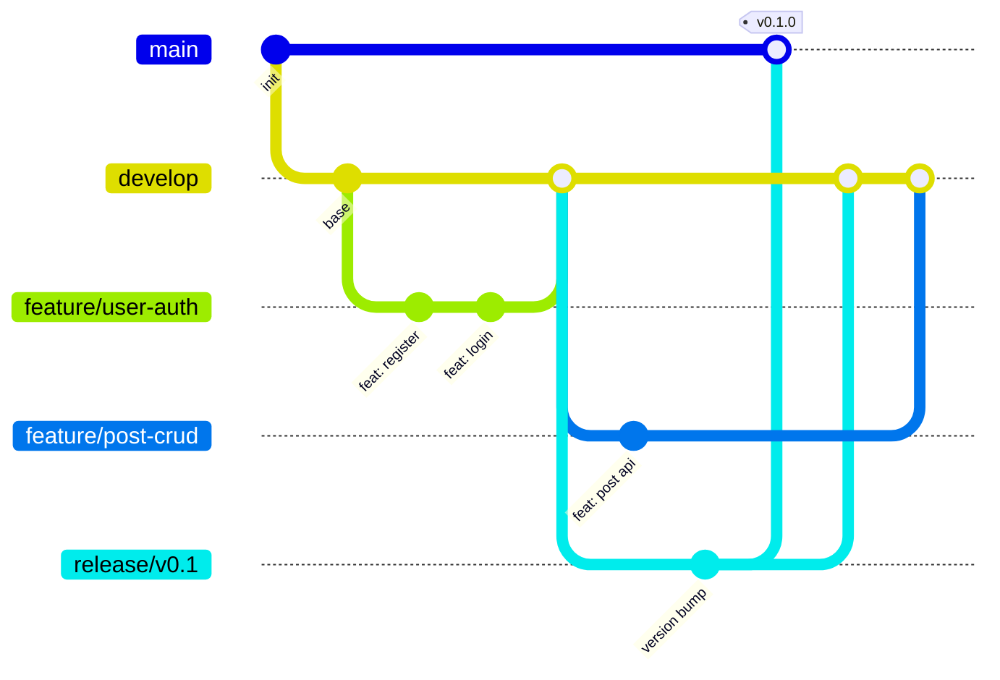

# Git 提交规范 — Pro-OW

> 版本: v1.0 | 基于 Conventional Commits

---

## 一、提交格式

```
<type>(<scope>): <subject>

<body>

<footer>
```

**示例：**
```
feat(content): add post CRUD API with Elasticsearch sync

- Implement create/read/update/delete endpoints for posts
- Add RabbitMQ event publishing on PostCreated
- Sync post index to Elasticsearch asynchronously

Closes #42
```

---

## 二、Type 类型

| Type | 说明 | 示例 |
|---|---|---|
| `feat` | 新功能 | `feat(user): add email verification` |
| `fix` | Bug 修复 | `fix(auth): fix token expiry check` |
| `refactor` | 重构(非功能/非修复) | `refactor(content): extract search logic` |
| `perf` | 性能优化 | `perf(search): add Elasticsearch caching` |
| `style` | 代码格式(不影响逻辑) | `style: format with prettier` |
| `docs` | 文档更新 | `docs(api): add notification endpoints` |
| `test` | 测试相关 | `test(auth): add login e2e tests` |
| `chore` | 构建/工具/依赖 | `chore(deps): upgrade prisma to 5.x` |
| `ci` | CI/CD 配置 | `ci: add GitHub Actions workflow` |
| `revert` | 回滚 | `revert: revert feat(post): add draft` |

---

## 三、Scope 范围

| Scope | 说明 |
|---|---|
| `user` | 用户服务 |
| `content` | 内容服务 |
| `social` | 社交服务 |
| `data` | 数据服务 |
| `ai` | AI 服务 |
| `realtime` | 实时服务 |
| `web` | Web 前端 |
| `admin` | 管理后台 |
| `gateway` | API 网关 |
| `infra` | 基础设施(Docker/配置) |
| `db` | 数据库迁移 |
| `shared` | 共享包 |
| `deps` | 依赖 |

---

## 四、分支规范

| 分支 | 用途 | 命名 |
|---|---|---|
| `main` | 生产分支(只接受 PR/MR) | `main` |
| `develop` | 开发分支 | `develop` |
| `feature/*` | 功能分支 | `feature/user-oauth` |
| `fix/*` | Bug 修复 | `fix/login-redirect` |
| `hotfix/*` | 紧急修复(从 main 分出) | `hotfix/xss-patch` |
| `release/*` | 发布分支 | `release/v0.1.0` |

### 分支工作流



---

## 五、Commit Message 规则

1. **Header 不超过 72 字符**
2. **Subject 用英文祈使句**：`add` 不是 `added` 或 `adds`
3. **Body 每行不超过 72 字符**
4. **与 Issue 关联**：`Closes #123` 或 `Refs #456`

### 好 vs 坏

```
# ✅ 好
feat(content): add ES full-text search support
fix(auth): prevent token refresh race condition

# ❌ 坏
update code
fix bug
WIP
asdf
.
```

---

## 六、版本号规范 (SemVer)

```
MAJOR.MINOR.PATCH

- MAJOR: 不兼容的 API 变更
- MINOR: 向下兼容的新功能
- PATCH: 向下兼容的 Bug 修复

示例:
v0.1.0  → v0.1.1  (修复了小 bug)
v0.1.0  → v0.2.0  (新增了组队功能)
v0.2.0  → v1.0.0  (正式发布)
```

---

## 七、PR/MR 规范

### PR 标题
```
feat(content): implement post CRUD API
```

### PR 描述模板

```markdown
## 变更说明
简要描述做了什么变更

## 变更类型
- [ ] 新功能 (feat)
- [ ] Bug 修复 (fix)
- [ ] 重构 (refactor)
- [ ] 文档 (docs)
- [ ] 其他

## 测试
- [ ] 单元测试通过
- [ ] 集成测试通过
- [ ] 手动测试通过

## 截图(UI 变更时)
<截图>

## 关联 Issue
Closes #42
```

### Code Review 检查清单

- [ ] 代码符合规范(命名、结构)
- [ ] 有适当的错误处理
- [ ] 没有硬编码的敏感信息
- [ ] TypeScript 类型安全(无 any)
- [ ] 新功能有测试
- [ ] 数据库迁移已添加
- [ ] API 文档已更新

---

## 八、Git Hooks (推荐配置)

```json
// .husky/commit-msg
{
  "hooks": {
    "commit-msg": "commitlint -E HUSKY_GIT_PARAMS",
    "pre-commit": "lint-staged"
  }
}
```

```json
// lint-staged 配置
{
  "*.{ts,tsx}": ["eslint --fix", "prettier --write"],
  "*.{json,md,yaml}": ["prettier --write"],
  "*.prisma": ["prisma format"]
}
```