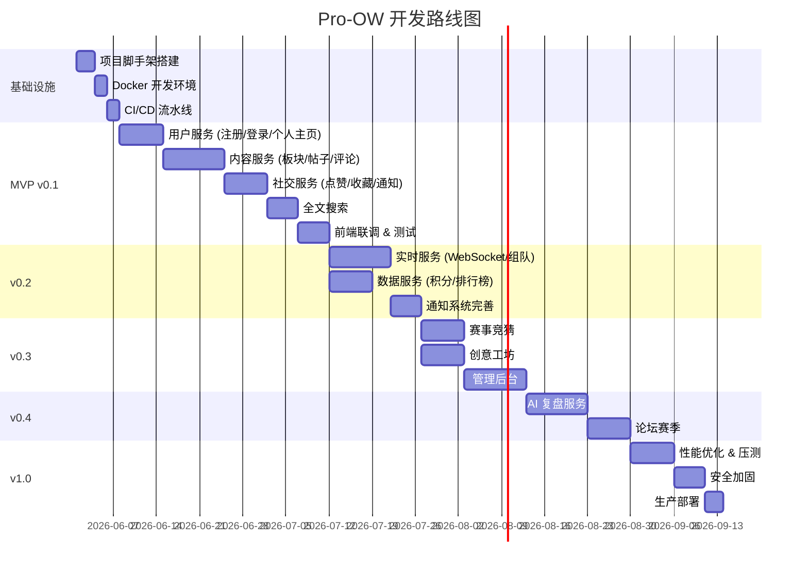

# 项目规划文档 — Pro-OW

> 版本: v1.0 | 日期: 2026-05-29

---

## 一、里程碑概览

---

## 二、v0.1 MVP 详细任务分解

### 阶段 1：基础设施搭建（Week 1, Day 1-5）

| # | 任务 | 负责人 | 预估 | 产出 |
|---|---|---|---|---|
| 1.1 | 初始化 Turborepo Monorepo | 后端 | 0.5d | 项目结构、tsconfig、eslint |
| 1.2 | 搭建 Docker Compose 开发环境 | 后端 | 1d | PostgreSQL, Redis, ES, RabbitMQ, MinIO |
| 1.3 | NestJS 项目模板(user-service) | 后端 | 1d | 基础 CRUD、Prisma、Swagger |
| 1.4 | NestJS 项目模板(content/social/data) | 后端 | 1d | 三个服务骨架 |
| 1.5 | React + Vite 前端脚手架 | 前端 | 1d | Tailwind, shadcn/ui, 路由 |
| 1.6 | Nginx 网关配置 | 后端 | 0.5d | 反向代理、CORS |

### 阶段 2：用户服务（Week 1-2）

| # | 任务 | 预估 | 依赖 |
|---|---|---|---|
| 2.1 | 数据库迁移(users, profiles, stats, tokens) | 1d | 1.2 |
| 2.2 | 注册接口(邮箱验证) | 1d | 2.1 |
| 2.3 | 登录/登出/RefreshToken 接口 | 1d | 2.2 |
| 2.4 | JWT 鉴权守卫 | 0.5d | 2.3 |
| 2.5 | 个人主页接口(CRUD) | 1d | 2.4 |
| 2.6 | 角色权限中间件 | 0.5d | 2.4 |
| 2.7 | 前端：登录/注册页面 | 1d | - |
| 2.8 | 前端：个人主页 | 1d | 2.5 |

### 阶段 3：内容服务（Week 2-4）

| # | 任务 | 预估 | 依赖 |
|---|---|---|---|
| 3.1 | 数据库迁移(boards, posts, tags, comments, media) | 1d | 1.2 |
| 3.2 | 板块列表/详情接口 | 0.5d | 3.1 |
| 3.3 | 帖子 CRUD 接口 | 2d | 3.1 |
| 3.4 | 富文本图片上传(MinIO) | 1d | 3.1 |
| 3.5 | 评论 CRUD 接口 | 1d | 3.3 |
| 3.6 | ES 搜索引擎集成 | 2d | 3.3 |
| 3.7 | RabbitMQ 事件发布(PostCreated/Deleted) | 1d | 3.3 |
| 3.8 | 前端：首页帖子列表(分页+排序) | 1.5d | 3.3 |
| 3.9 | 前端：帖子详情页 | 1d | 3.3 |
| 3.10 | 前端：发帖编辑器(富文本) | 1.5d | 3.4 |
| 3.11 | 前端：评论区 | 1d | 3.5 |
| 3.12 | 前端：搜索页 | 1d | 3.6 |

### 阶段 4：社交服务（Week 4-5）

| # | 任务 | 预估 | 依赖 |
|---|---|---|---|
| 4.1 | 数据库迁移(likes, favorites, follows, notifications) | 0.5d | 1.2 |
| 4.2 | 点赞/取消点赞接口 | 1d | 4.1 |
| 4.3 | 收藏/取消收藏接口 | 0.5d | 4.1 |
| 4.4 | 关注/取消关注接口 | 0.5d | 4.1 |
| 4.5 | 通知生成+列表接口 | 1d | 4.1 |
| 4.6 | RabbitMQ 事件订阅(CommentCreated → 通知) | 1d | 4.2 |
| 4.7 | 前端：点赞/收藏交互 | 0.5d | 4.2 |
| 4.8 | 前端：通知中心 | 1d | 4.5 |

### 阶段 5：联调测试（Week 5）

| # | 任务 | 预估 |
|---|---|---|
| 5.1 | 前端-后端联调 | 2d |
| 5.2 | 集成测试(核心流程) | 1d |
| 5.3 | Bug 修复 | 1d |
| 5.4 | 性能初步测试 | 1d |

---

## 三、v0.2 任务分解

### 阶段 6：实时 + 数据服务（Week 6-8）

| # | 任务 | 预估 |
|---|---|---|
| 6.1 | Go 实时服务搭建(WebSocket) | 2d |
| 6.2 | 在线状态管理(Redis) | 1d |
| 6.3 | 通知实时推送 | 1d |
| 6.4 | 数据库迁移(teams, team_members, chat) | 1d |
| 6.5 | 组队大厅接口 | 2d |
| 6.6 | 队伍实时聊天 | 1.5d |
| 6.7 | 数据服务：积分/等级系统 | 2d |
| 6.8 | 数据服务：排行榜接口 | 1d |
| 6.9 | RabbitMQ 事件消费(积分累计) | 1d |

---

## 四、风险与缓解

| 风险 | 概率 | 影响 | 缓解 |
|---|---|---|---|
| 微服务间联调复杂度高 | 中 | 进度延迟 | Docker Compose 统一环境 + API 文档先行 |
| Elasticsearch 中文搜索效果差 | 中 | 用户体验差 | 配置 IK 分词 + OW 术语词典 |
| Go WebSocket 开发经验不足 | 高 | 实时功能延期 | v0.1 先用 Socket.IO 过渡 |
| 前端富文本编辑器选型困难 | 低 | UI 体验 | 优先 Tiptap(ProseMirror)，备选 Quill |
| 战网 API 限频 | 中 | 数据同步慢 | 本地缓存 + 定时批量更新 |

---

## 五、团队配置(建议)

| 角色 | 人数 | 职责 |
|---|---|---|
| 后端开发 | 2 | NestJS 微服务 + 数据库 + 基础设施 |
| 前端开发 | 1 | React Web + 管理后台 |
| 全栈/架构 | 1 | 架构设计、代码评审、Go 实时服务 |
| AI 工程师 | 0.5(兼职) | AI 复盘服务(Python) |